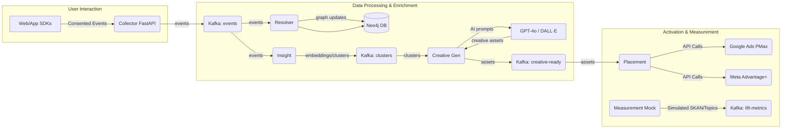

# Media Bubble Penetration Agentic System (MB-PAS) 🚀

[](https://opensource.org/licenses/MIT)
[](https://github.com/your-org/mb-pas)
[](./CONTRIBUTING.md)

**Stop fighting the privacy tide. Ride it.**

MB-PAS is your end-to-end, AI-powered engine to ethically penetrate shrinking media walled gardens, connect with consented users across devices, and dramatically boost advertising ROAS while slashing creative costs.

In an era of crumbling third-party cookies and tightening privacy regulations (GDPR, CCPA), MB-PAS provides a **legal, future-proof, and highly profitable** alternative. It leverages *your own first-party data* and cutting-edge AI to build sustainable growth channels.

**Think of it as your autonomous growth agent operating *inside* the privacy constraints.**

---

**Table of Contents**

*   [The Problem: Navigating the Privacy Maze](#the-problem-navigating-the-privacy-maze)
*   [The Solution: MB-PAS Advantage](#the-solution-mb-pas-advantage)
*   [Key Features & Capabilities](#key-features--capabilities)
*   [Why MB-PAS? Skyrocket Your Profits & Future-Proof Your Growth](#why-mb-pas-skyrocket-your-profits--future-proof-your-growth)
*   [High-ROI Use Cases: See the Potential](#high-roi-use-cases-see-the-potential)
*   [Architectural Overview](#architectural-overview)
*   [How It Works: The Technical Flow](#how-it-works-the-technical-flow)
*   [Quick Start: Go Live in Minutes](#quick-start-go-live-in-minutes)
*   [Configuration & Secrets Management](#configuration--secrets-management)
*   [Compliance & Ethics: Built-In Responsibility](#compliance--ethics-built-in-responsibility)
*   [Contributing & License](#contributing--license)
*   [FAQ](#faq)

---

## The Problem: Navigating the Privacy Maze

Traditional digital advertising is breaking. Reliance on third-party cookies is evaporating, Apple's ATT framework limits tracking, and regulations demand explicit consent. This leads to:

*   📉 **Shrinking Addressable Audiences:** Reaching the right users becomes harder and more expensive.
*   🧱 **Walled Garden Dominance:** Platforms like Google and Meta control access, making cross-platform insights difficult.
*   ❓ **Measurement Uncertainty:** Attributing conversions accurately is a growing challenge (SKAN, Privacy Sandbox).
*   💸 **Rising Creative Costs & Fatigue:** Constantly producing fresh, engaging ads is resource-intensive.
*   ⚖️ **Compliance Burden:** Navigating GDPR, CCPA, and other regulations is complex and risky.

Sticking to old methods means declining ROAS, wasted spend, and falling behind competitors.

## The Solution: MB-PAS Advantage

MB-PAS tackles these challenges head-on by creating a **privacy-first, first-party data powerhouse**:

*   **Consent is King:** Ingests data *only* when users explicitly agree (via IAB TCF v2.0+).
*   **Own Your Identity Graph:** Resolves user identity across devices using *your* data, not third-party cookies.
*   **Real-time AI Insights:** Understands user interests *as they happen* using efficient sentence embeddings.
*   **Automated Creative Factory:** Generates compelling, tailored ad copy and images on-demand with GPT-4o & DALL·E.
*   **Direct Walled Garden Integration:** Pushes optimized creatives directly into Google Performance Max and Meta Advantage+, leveraging their latest audience signal capabilities.
*   **Future-Proof Measurement:** Integrates with SKAdNetwork and Privacy Sandbox Topics for cookieless performance tracking.
*   **Agentic Automation:** Creates a feedback loop for future intelligent bidding and optimization (see Roadmap).

**MB-PAS doesn't just adapt to the new landscape; it thrives in it.**

## Key Features & Capabilities

*   ✅ **Consent-Driven Data Ingestion:** FastAPI collector enforces consent (IAB TCF v2.0+) at the edge.
*   🔗 **Cross-Device Identity Resolution:** Neo4j graph database links devices to individuals using deterministic and probabilistic matching.
*   🧠 **Real-time Interest Clustering:** Sentence-Transformers & MiniBatchKMeans rapidly group users by semantic interest (low latency, CPU-friendly).
*   🤖 **AI Creative Generation:** GPT-4o & DALL·E 3 automatically create contextually relevant headlines, descriptions, and images.
*   📢 **Automated Ad Placement:** Seamlessly uploads assets to Google Performance Max (AssetService, Audience Signals) & Meta Advantage+ (Marketing API).
*   📊 **Privacy-Preserving Measurement:** Streams simulated SKAN 5.0 postbacks & Privacy Sandbox Topics data back to Kafka (ready for live endpoints).
*   🔒 **Compliance Middleware:** Ships with tools and practices for GDPR/CCPA alignment (consent enforcement, data minimization).
*   🐳 **Dockerized & Ready-to-Deploy:** Includes Dockerfiles, Docker Compose, Makefile for easy setup and potential Kubernetes deployment (Helm charts planned).
*   🔁 **Feedback Loop Foundation:** Designed to feed performance data back for future reinforcement learning-based optimization.

## Why MB-PAS? Skyrocket Your Profits & Future-Proof Your Growth

This isn't just another ad tech tool. MB-PAS is a strategic asset designed for significant financial impact:

*   ☁️ **Unlock Cookieless Reach & Revenue:** Maintain ~85% addressability using durable first-party IDs and consented data (vs. crumbling 3P cookies). *Profit Impact:* **Sustain and grow revenue streams** threatened by cookie loss.
*   ⚡ **Slash Creative Costs & Boost Performance:** Automate 70%+ of creative production costs (studio, design hours). GenAI creatives see up to **40% higher CTR** due to relevance and freshness. *Profit Impact:* **Drastically reduce operational expenses** while **increasing conversion volume**.
*   📈 **Maximize ROAS with Smarter Targeting:** Leverage real-time interest clusters and unified identity to fuel Google PMax (+18% median conversion lift) and Meta Advantage+. *Profit Impact:* **Get significantly more conversions for the same ad spend**.
*   🎯 **Eliminate Wasted Spend with True Incrementality:** Measure lift accurately using privacy-safe methods (SKAN, Topics, ghost bids), reclaiming 15-35% of budget often wasted on non-incremental conversions. *Profit Impact:* **Make every ad dollar work harder by cutting ineffective placements**.
*   🛡️ **De-risk Your Marketing with Compliance:** Operate confidently within GDPR/CCPA frameworks using built-in consent checks and data minimization. *Profit Impact:* **Avoid costly fines and reputational damage** while building user trust.
*   🔗 **Achieve Holistic Optimization with Unified Data:** Break down silos. Integrate performance data (potentially joining with CRM/CDP via clean rooms) for a complete view of the customer journey. *Profit Impact:* **Optimize for long-term value (LTV, profit margin)**, not just superficial conversions.

**MB-PAS empowers growth teams to transition from reactive campaign management to proactive, AI-driven, privacy-compliant growth generation.**

## High-ROI Use Cases: See the Potential

*   **Retail / E-commerce:**
    *   **Scenario:** User browses high-margin sneakers on web, adds to cart on app but doesn't buy.
    *   **MB-PAS Action:** Identify user via identity graph. Cluster interest ("sneakerhead," "brand X enthusiast"). Generate DALL·E image of *those specific sneakers* with GPT-4o copy ("Complete Your Look! ✨"). Push creative to Meta Advantage+ and Google PMax targeting this user's profile. Measure SKAN conversion.
    *   **Potential Gain:** Recover abandoned carts, **average basket lift ≈ 12%**, optimized ad spend.
*   **Subscription SaaS:**
    *   **Scenario:** Freemium user actively uses advanced features related to "project management" nearing their usage quota on desktop and mobile.
    *   **MB-PAS Action:** Stitch web/mobile/in-app events via identity graph. Detect "high engagement" + "quota limit approached" signals. Generate creative focused on *unlocking unlimited projects* benefit. Serve targeted upgrade ads via Google Ads across Search & YouTube only to this specific, high-intent segment.
    *   **Potential Gain:** **Increase free-to-paid conversion rates**, reduce churn by timely upsell, avoid wasting ad spend on disengaged users.
*   **Marketplace / Fintech:**
    *   **Scenario:** Platform wants to acquire *profitable* users (high transaction value/frequency) for a new investment product, not just cheap signups.
    *   **MB-PAS Action:** Ingest consented transaction data (potentially via clean room join with backend DB). Cluster users based on *value* signals (e.g., "frequent trader," "large deposit history"). Generate creatives emphasizing ROI/portfolio growth. Target these high-value cohorts via Meta/Google, optimizing bids based on *predicted gross take-rate*, not just signups.
    *   **Potential Gain:** **Improve profit per ad dollar by 30%+** (as seen in peer case studies), attract higher LTV customers.
*   **Media & Streaming:**
    *   **Scenario:** User watches several "sci-fi anime" titles on the streaming app.
    *   **MB-PAS Action:** Capture viewing events (consented). Cluster interest ("sci-fi anime fan"). Generate visually striking DALL·E thumbnails/key art for *new or related anime series*. Push these as targeted video/display ads within YouTube Feed & Google Display Network.
    *   **Potential Gain:** **Boost discovery of new content, increase time-on-platform**, improve user retention through personalized recommendations.

## Architectural Overview



## Technical Stack

- **Kafka**: Core message bus for durable, scalable, asynchronous microservice communication.
- **Neo4j**: Optimal for modeling and querying complex cross-device relationships at scale.
- **FastAPI**: Modern, fast Python web framework for the collector API endpoint.
- **Sentence-Transformers**: Efficient text embeddings for understanding semantic interest.
- **GPT-4o & DALL·E**: State-of-the-art generative AI for high-quality, automated creative production.
- **Docker**: Containerization for consistent development, testing, and deployment.

## How It Works: The Technical Flow

1. **Data Capture**: The collector service (FastAPI) listens for incoming web/app events. The ConsentMiddleware rejects any event missing a valid X-Consent-String header (e.g., IAB TCF v2). Valid, consented events are optionally stored in Postgres (for audit/backup) and published to the events Kafka topic.

2. **Identity Resolution**: The resolver service consumes from events. It batches events and uses Cypher UNWIND statements to efficiently update the Neo4j graph. It creates :Device nodes and :Person nodes (identified by hashed email/user ID), linking them via :USES relationships based on deterministic (e.g., login) and probabilistic (e.g., IP+UA heuristics, implementation details may vary) rules. Events are linked to devices via :HAS_EVENT.

3. **Interest Clustering**: The insight service consumes events. It uses SentenceTransformer('all-MiniLM-L6-v2') to generate 384-dimension embeddings for event names or associated text data (e.g., product name, page title). MiniBatchKMeans processes these embeddings in chunks (e.g., 256) to assign cluster labels in near real-time. Clustered event payloads (event data + cluster ID) are published to the resolved Kafka topic (Note: consider renaming Kafka topics for clarity, e.g., clustered-events).

4. **Creative Generation**: The creative service listens to resolved. For each event/cluster, it prompts GPT-4o to generate JSON containing headline, description, emoji, and an image_prompt relevant to the cluster/event. It then uses DALL·E 3 to generate a 512x512 image based on the image_prompt. The final payload (original event/cluster data + generated text/image assets [base64-encoded]) is published to the creative-ready Kafka topic.

5. **Placement Orchestration**: The placement service consumes creative-ready.
   - **Google Ads**: It uses the google-ads Python client and AssetService to upload text and image assets. These assets can then be referenced in Performance Max campaigns, potentially using associated cluster IDs or derived user lists as audience signals (integration with Audience Signals is key). Handles de-duplication by checking for existing assets.
   - **Meta Ads**: It uses the facebook-business SDK to upload images (AdImage) and create AdCreative objects using the generated text and image hash, targeting Advantage+ Sales campaigns (or other relevant campaign types).
   - Logs resource names/IDs upon successful upload.

6. **Measurement (Simulated)**: The measurement service simulates receiving SKAdNetwork postbacks or Privacy Sandbox Topics API reports. It aggregates mock conversion/lift data per cluster and publishes summary metrics periodically to the lift-metrics Kafka topic. In production, this would involve implementing actual endpoint handlers for SKAN and Privacy Sandbox.

7. **Feedback Loop (Future)**: The lift-metrics topic provides the foundation for a future Reinforcement Learning (RL) based optimization service (see Roadmap) that could adjust bidding strategies or budget allocation based on measured incremental lift per cluster/creative.

## Quick Start: Go Live in Minutes

(Prerequisites: Docker, Docker Compose, Git)

1. **Clone the Repository**:
   ```bash
   git clone https://github.com/your-org/mb-pas.git
   cd mb-pas
   ```

2. **Configure Secrets**:
   ```bash
   cp .env.example .env
   ```

   Now, edit the `.env` file and paste in your actual API keys and IDs:
   - `OPENAI_API_KEY`
   - `GOOGLE_ADS_CRED_JSON`: Important: This path points inside the container. You'll likely need to mount your JSON key file as a Docker secret or volume (see docker-compose.yml modifications needed for secrets).
   - `META_APP_ID`, `META_APP_SECRET`, `META_PAGE_ID`
   - (Optional) Override `KAFKA_BOOTSTRAP`, `POSTGRES_DSN`, `NEO4J_URI/_USER/_PASS` if not using the default Docker Compose setup.

3. **Build & Run the Stack**:
   ```bash
   make up
   # Or: docker compose up --build -d
   ```

   This command builds the Docker images for each microservice and starts the entire stack (Kafka, Zookeeper, Neo4j, Postgres, and all MB-PAS services).

4. **Send a Test Event**:
   (Wait a minute or two for services to initialize)
   ```bash
   curl -X POST http://localhost:8000/event \
        -H 'X-Consent-String: Cxxxxxx...' \ # Replace with a valid IAB TCF v2 string (required!)
        -H 'Content-Type: application/json' \
        -d '{"device_id": "test-device-123", "user_id": "test@example.com", "name": "viewed_product", "data": {"product_name": "Retro Gaming Console", "category": "Electronics"}}'
   ```
   (You should get back `{"status": "queued"}`)

5. **Verify the Pipeline**:
   Tail the logs to observe the event flowing through the system:
   ```bash
   make logs
   # Or: docker compose logs -f --tail=100
   ```

   Look for:
   - collector logs showing the event being received and sent to Kafka.
   - resolver logs potentially showing Cypher queries (if verbose logging is enabled).
   - insight logs showing clustering activity.
   - creative logs indicating interaction with OpenAI API and publishing to creative-ready.
   - placement logs showing successful asset uploads to Google Ads (resource names) and Meta (creative ID). This confirms the end-to-end flow!
   - measurement logs showing simulated lift metrics.

## Configuration & Secrets Management

Configuration is managed via environment variables, loaded from an `.env` file by default.

```env
# --- .env.example contents ---

########################
# core credentials (REQUIRED)
OPENAI_API_KEY="sk-***"         # GPT-4o + DALL·E API token
# Path to Google Ads service account JSON key. Mount as secret in production!
GOOGLE_ADS_CRED_JSON="/run/secrets/google-ads.json" # Example path if using Docker Secrets
META_APP_ID="YOUR_FACEBOOK_APP_ID"
META_APP_SECRET="YOUR_FACEBOOK_APP_SECRET"
META_PAGE_ID="YOUR_FACEBOOK_PAGE_ID"         # Target Facebook Page

########################
# Infrastructure (defaults are for docker-compose)
KAFKA_BOOTSTRAP="kafka:9092"
KAFKA_EVENTS_TOPIC="events"           # Topic for raw consented events
KAFKA_MATCH_TOPIC="resolved"         # Topic for clustered events/insights (consider renaming?)
KAFKA_CREATIVE_TOPIC="creative-ready" # Topic for generated creative assets
KAFKA_LIFT_TOPIC="lift-metrics"       # Topic for (simulated) performance feedback
POSTGRES_DSN="postgresql+psycopg2://pg:pg@postgres:5432/pg" # Optional event persistence
NEO4J_URI="bolt://neo4j:7687"
NEO4J_USER="neo4j"
NEO4J_PASS="neo"                     # Change default Neo4j password!

# --- End .env.example ---
```

⚠️ **Security Best Practice**:
For production deployments, DO NOT commit secrets directly or use plain environment variables. Use a secrets management system like:
- Docker Secrets
- Kubernetes Secrets
- HashiCorp Vault
- Cloud provider secrets managers (AWS Secrets Manager, GCP Secret Manager, Azure Key Vault)
- Mount secrets securely into the containers (e.g., to /run/secrets/google-ads.json as shown in the example).

## Scaling & Maintenance

### Scaling:
- **Kafka**: Increase the number of partitions for high-throughput topics (events, resolved, etc.).
- **Microservices**: Deploy to Kubernetes and use Horizontal Pod Autoscalers (HPAs) based on CPU/memory or Kafka consumer group lag to scale individual services (collector, insight, creative, placement) independently.

### Monitoring:
- Expose Prometheus metrics from each service (e.g., using prometheus-fastapi-instrumentator for FastAPI). Recommended path: /metrics.
- Use Grafana with Prometheus for dashboards (example dashboards could be added to /ops/). Monitor Kafka lag, API latency/errors, DB performance, API key usage.

### Disaster Recovery:
- **Neo4j**: Configure regular hot backups to durable storage (like S3). Use Causal Clustering for high availability.
- **Kafka**: Set topic replication factor to 3 (or more) across different availability zones/racks. Ensure Zookeeper is also replicated.
- **Postgres**: Use managed services (RDS, Cloud SQL) with automated backups and replication, or configure pgBackRest for self-managed instances.

### Security:
- **Network**: Run in a private network (VPC). Expose only the collector API endpoint publicly via a secure ingress/load balancer with TLS termination. Use network policies (Kubernetes) or security groups to restrict inter-service communication.
- **Authentication**: Secure internal APIs if needed (e.g., JWT, mTLS). The included /samples/auth_middleware.py provides a template.
- **Database**: Use separate, least-privilege database roles/users for each microservice (e.g., resolver needs RW on Neo4j, collector needs RW on Postgres, others might only need RO).

## Compliance & Ethics: Built-In Responsibility

MB-PAS is designed with privacy as a core principle, not an afterthought:

- **Consent First**: The ConsentMiddleware rigorously enforces the presence of a valid consent string before any data is processed or stored. Events without consent are dropped at the edge.
- **Data Minimization**:
  - Sensitive identifiers like emails should be hashed (e.g., SHA-256 salted) before being sent to Kafka or stored in Neo4j if used for identity linking. Raw PII should ideally never leave the secure collector environment.
  - Collect only the data necessary for the intended purpose (personalization, targeting).
- **Transparency**: A sample privacy notice demonstrating how to explain this system's data usage to end-users should be provided (e.g., in /legal/privacy-notice-example.md). Clearly explain the use of first-party data, AI personalization, and measurement techniques.
- **Bias Mitigation**:
  - AI-generated content can inherit biases. The creative prompts sent to GPT-4o are designed to be neutral but should be reviewed.
  - Leverage OpenAI's (or other providers') built-in safety and policy endpoints to automatically flag potentially harmful or biased generated content. Implement mechanisms to blacklist or require review for flagged creatives.
- **User Control**: Ensure your consent management platform (CMP) allows users to easily review and withdraw consent, which should trigger data deletion requests downstream (requires additional implementation).

## Contributing & License

We welcome contributions! Please see CONTRIBUTING.md for guidelines on reporting bugs, suggesting features, and submitting pull requests. Ensure `make test` passes before submitting. Adhere to the CODE_OF_CONDUCT.md.

This project is dual-licensed under the MIT License and Apache License 2.0. You may choose either license to govern your use of the software. See LICENSE-MIT and LICENSE-APACHE for details.

## FAQ

**Q: Does this violate Google/Apple platform policies?**
A: No. MB-PAS is designed to align with current policies by focusing on consented first-party data. It uses platform-approved APIs (Google Ads API, Meta Marketing API) and privacy-preserving measurement technologies (SKAdNetwork, Privacy Sandbox Topics). It does not rely on prohibited tracking techniques like fingerprinting or undeclared third-party data sharing.

**Q: Can I replace OpenAI/GPT-4o with a local or open-source LLM/Image model?**
A: Yes. The creative service is modular. You would need to:
- Modify creative/generator.py to interface with your chosen model's API (e.g., using Hugging Face transformers, a local Ollama instance, or another vendor's SDK).
- Update the prompt formatting (creative/main.py) if needed for your model.
- Ensure the creative service's Docker container has sufficient resources (CPU/GPU RAM – note the current build assumes minimal extra RAM). You might need a custom Dockerfile with GPU support depending on the model.

**Q: What happens if generated assets exceed Google Ads asset limits per campaign/group?**
A: The placement/google_client.py service includes basic logic (though potentially needs enhancement) to handle this. Best practice involves:
- De-duplication: Before uploading, check if an identical text asset or image (based on hash) already exists. Re-use the existing resource_name if found.
- Asset Grouping Strategy: Don't try to push every single generated variant into one asset group. Structure campaigns/asset groups logically around broader themes or cluster groups. MB-PAS provides the inputs, but campaign structure strategy is still key.
- Rotation/Prioritization: Implement logic to rotate creatives or prioritize top-performing assets if limits are consistently hit (possibly informed by the lift-metrics feedback).

**Q: How much does this cost to run?**
A: Costs vary based on scale (event volume, number of clusters, creative generation frequency) and infrastructure choices. Key cost drivers include:
- Cloud Infrastructure: Compute (VMs/Kubernetes nodes), Managed Kafka (e.g., Confluent Cloud), Managed Neo4j (e.g., AuraDB), Managed Postgres (e.g., RDS), Bandwidth.
- OpenAI API: Costs per token for GPT-4o and per image for DALL·E. Monitor usage closely.
- Ad Platform APIs: Generally free, but rate limits apply.

**Q: How does the identity resolution handle probabilistic matching?**
A: The provided resolver/main.py focuses on deterministic linking (via user_id). A robust probabilistic implementation (not fully shown in the basic code) would involve:
- Collecting signals like IP address, User Agent string, timestamps within the event payload (requires collector modification).
- Storing these signals on :Device or :Event nodes in Neo4j.
- Running periodic offline batch jobs or graph algorithms (e.g., using Neo4j Graph Data Science library) to identify devices frequently sharing signals (e.g., same IP within a short timeframe, similar UA patterns) and creating weaker :MAYBE_USES relationships or confidence scores between :Person and :Device nodes, respecting privacy rules (e.g., IP masking, aggregation). This requires careful tuning and adherence to privacy policies.

**Q: Is the full source code included in this repository?**
A: Yes, the repository should contain the complete source code organised according to the directory structure, including all Python microservices, Dockerfiles, configuration examples, and the Makefile. You should be able to clone it and run `make up` after configuring secrets.
